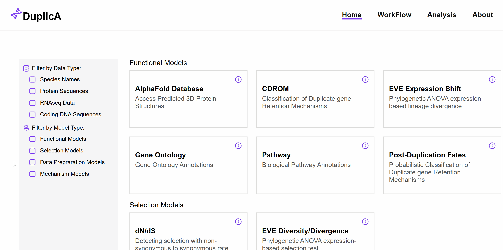
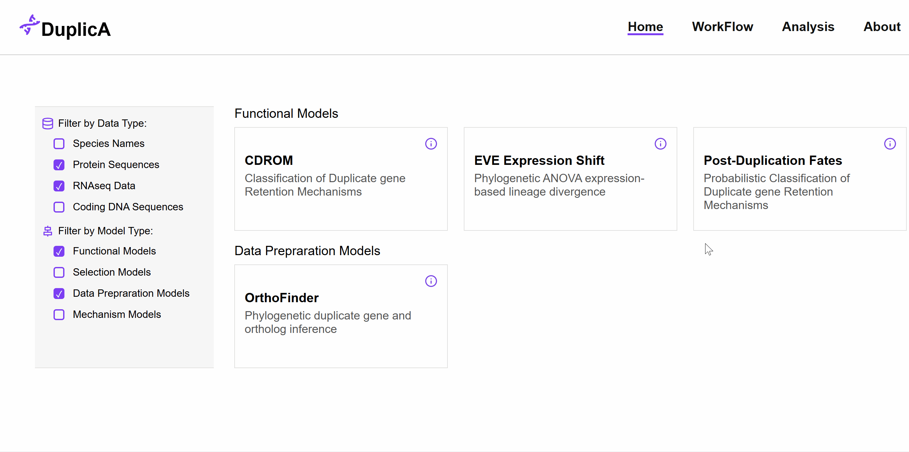
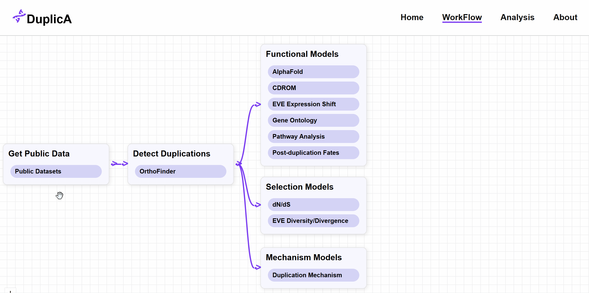
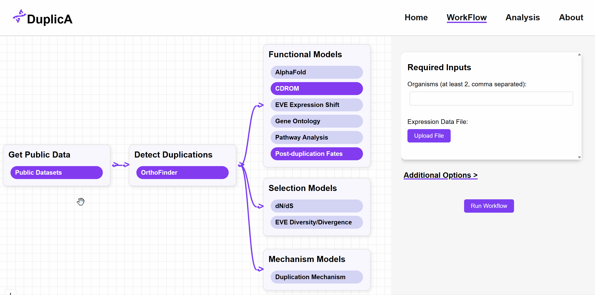
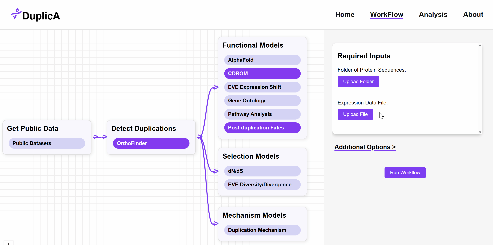
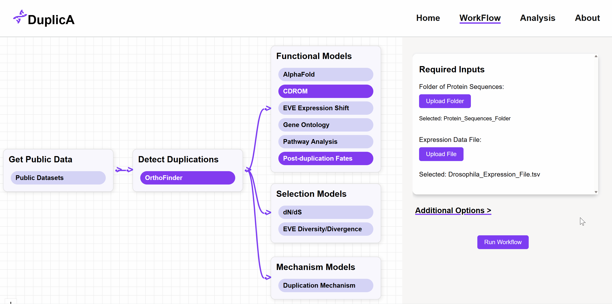
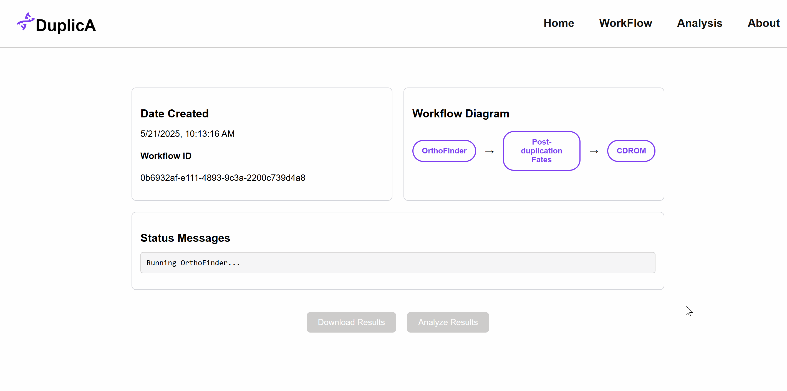
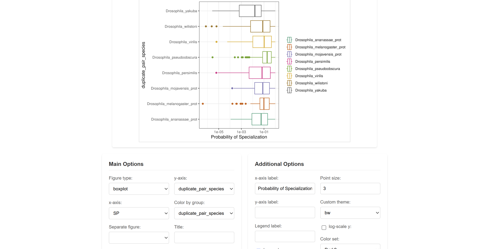
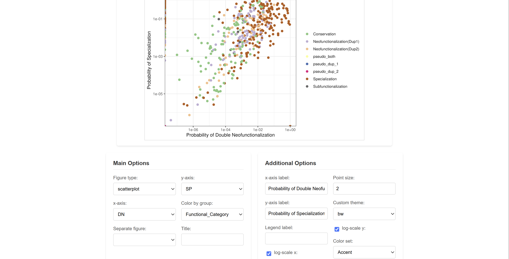

<a id="readme-top"></a>
<!-- PROJECT LOGO -->
<br />
<div align="center">
  <a href="https://github.com/NathanDuda/DuplicA">
    
  </a>
    <h3 align="center">A phylogenomic toolkit for duplicate gene analysis.</h3>
</div>


# DuplicA `README`

## About

DuplicA is an interactive web-based platform for running models of gene duplication, expression, selection, and function across multiple species. It integrates genomic datasets, public databases, and statistical modeling into a seamless analysis and visualization workflow.

&nbsp;
## Requirements

- Docker (install from: https://docs.docker.com/engine/install/)

&nbsp;
## Installation

**1. Clone the repository:**

```sh
git clone https://github.com/NathanDuda/DuplicA.git
```

**2. Build the Docker image:**

```sh
cd DuplicA
sudo docker build -t duplic-a .
```

This may take 10-15 minutes the first time you use the app. 

**3. Run the app:**

```sh
./run_duplica
```

**5. Open the app**

Now that the app is running locally, go to http://localhost:8000 


&nbsp;
## Using your own data

To analyze your own data with the app, place all files in a single folder and start the app by specifying the path to that folder.

```sh
./run_duplica /path/to/your/data_folder
```

Change `/path/to/your/data_folder` to the actual path to your data. 


&nbsp;
## Tutorial

### Home Page
**Browse and filter available models**<br>


**View information about a selected model**<br>


---

### Run a Workflow 
**Select models to include in your workflow**<br>


**Exclude models and required inputs update automatically**<br>


**Upload your data**<br>


**Execute the workflow**<br>


**Monitor progress and status updates**<br>


---

### Analyze Workflow Results
**Easily generate custom figures from your results**<br>


**Choose from multiple figure types**<br>



&nbsp;
## Troubleshooting

### **Error: `Cannot connect to the Docker daemon at unix:///var/run/docker.sock`**

**Solution:**

Run docker daemon:

```sh
sudo service docker start 
```


### **Error: `permission denied while trying to connect to the Docker daemon`**

**Solution:**

Run the app as super user:

```sh
sudo ./run_duplica
```

**Or:**

Add yourself to the Docker group:

```sh
sudo usermod -aG docker $USER
new_group docker
```

&nbsp;
## Contact

**Nathan Duda**
- GitHub: [@NathanDuda](https://github.com/NathanDuda)
- Email: nathanduda02@gmail.com


